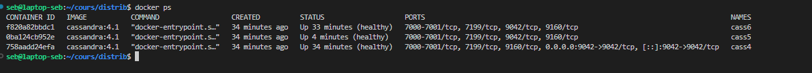
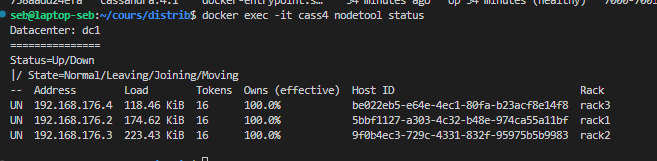
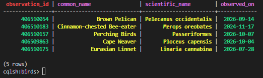
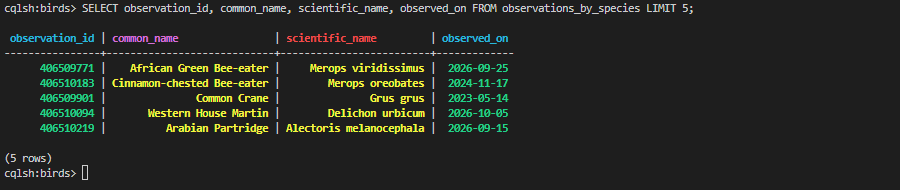
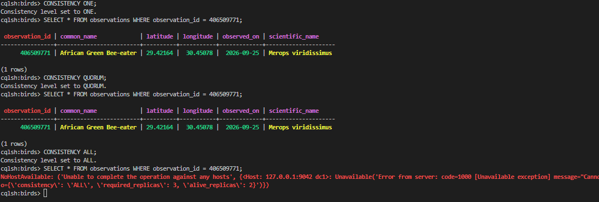
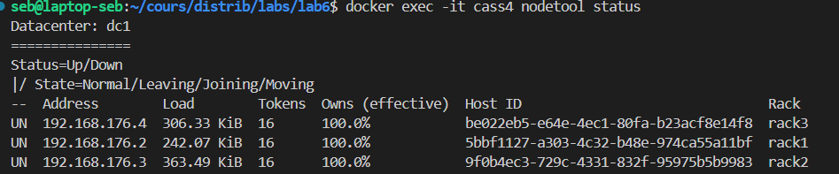
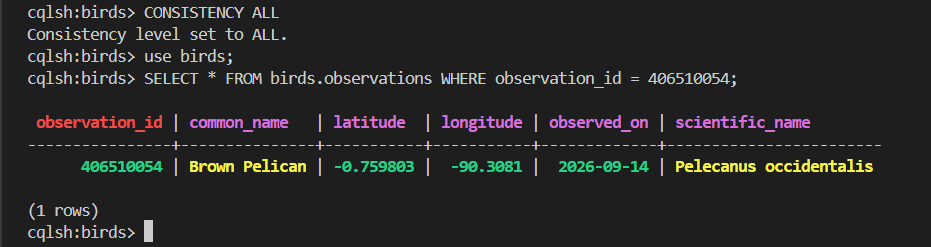

# Compte rendu Sébastien Borgne 

## 1. Architecture du cluster

Le cluster `tp2-cluster` est composé de trois nœuds dans le datacenter `dc1`. Chaque nœud est placé dans un rack différent afin de répartir les réplicas entre plusieurs domaines de panne.

| Nœud | Datacenter | Rack | État attendu après démarrage |
|---|---|---|---|
| `cass4` | `dc1` | `rack1` | `UN` — Up/Normal |
| `cass5` | `dc1` | `rack2` | `UN` — Up/Normal |
| `cass6` | `dc1` | `rack3` | `UN` — Up/Normal |

Un cluster est l'ensemble des instances Cassandra qui coopèrent. Un datacenter est un regroupement logique de nœuds ; un rack est un regroupement logique dans un datacenter, utile notamment pour répartir les copies ; un nœud est une instance Cassandra individuelle.

Le fichier Compose démarre les nœuds progressivement à l'aide de healthchecks et de `depends_on`. Un nœud peut temporairement être en état `UJ` (*Up/Joining*) avant de rejoindre l'état normal `UN`.

### Vérification

Etat des noeuds

## 2. Keyspace et table métier

Le keyspace utilisé est `birds`. La table principale du projet est `birds.observations` ; les autres tables sont des tables de requête dénormalisées créées pour différents accès.

| Table | Clé de partition | Clés de clustering |
|---|---|---|
| `observations` | `observation_id` | aucune |
| `observations_by_date` | `observed_on` | `observation_id` |
| `observations_by_species` | `scientific_name` | `observed_on`, `observation_id` |
| `observations_by_species_date` | `(scientific_name, observed_on)` | `observation_id` |
| `observations_by_common_name` | `common_name` | `observed_on`, `observation_id` |

La table principale contient `observation_id`, `common_name`, `scientific_name`, `observed_on`, `latitude` et `longitude`. Dans Cassandra, la clé primaire simple de `observations` est `observation_id`, qui est aussi sa clé de partition.

### Vérification des tables et des données

Les données viennent du script du tp précédent

Exemple de table métier

## 3. Partitionnement et réplication

Pour la table `observations`, Cassandra prend `observation_id` comme clé de partition, calcule son hash (Murmur3 par défaut) et obtient un token. Le token situe la partition sur l'anneau et permet d'identifier le nœud propriétaire de la plage de tokens. Avec RF = 3 dans `dc1`, Cassandra conserve trois copies de la partition au total, réparties sur les nœuds du datacenter en tenant compte des racks.

Le partitionnement décide où une partition est placée à partir de sa clé ; la réplication crée d'autres copies de cette partition sur différents nœuds. Le `Replication Factor` (RF) est le nombre total de copies, pas le nombre de copies supplémentaires.

> Par défaut, le projet crée le keyspace en `SimpleStrategy` avec `CASSANDRA_REPLICATION_FACTOR=1` (`.env` / `src/db_service.py`), inadapté à un cluster multi-nœuds. Le keyspace `birds` a été corrigé avant les tests avec `ALTER KEYSPACE birds WITH replication = {'class': 'NetworkTopologyStrategy', 'dc1': 3};` (confirmé par `DESCRIBE KEYSPACE birds;`).

## 4. Essais de cohérence
Avec tous les noeuds actifs, chaque lecture sur un `observation_id` existant peut être satisfaite par un réplica.

Simulation de panne de cass6:
  

## 5. Redémarrage et vérification des données
Apres avoir redémarré le nœud `cass6`, il rejoint le cluster et passe à l'état `UN`. Le volume Docker persistant conserve les fichiers locaux du nœud. Cassandra peut rattraper certaines écritures manquées via les mécanismes prévus, mais le retour au ring ne prouve pas à lui seul que toutes les données sont synchronisées : contrôler les résultats et effectuer une réparation si nécessaire.

Les données sont bien présentes au retour de cass6

## 6. Conclusion

La réplication conserve plusieurs copies des partitions sur des nœuds différents. Si un nœud tombe en panne, Cassandra peut continuer à répondre aux requêtes si le nombre de réplicas joignables satisfait le niveau de cohérence demandé. Avec trois réplicas, une panne laisse théoriquement deux copies disponibles : `ONE` et `QUORUM` peuvent encore répondre, tandis que `ALL` exige le retour des trois réplicas. La tolérance aux pannes dépend donc conjointement du facteur de réplication, de l'emplacement des réplicas et du niveau de cohérence.

